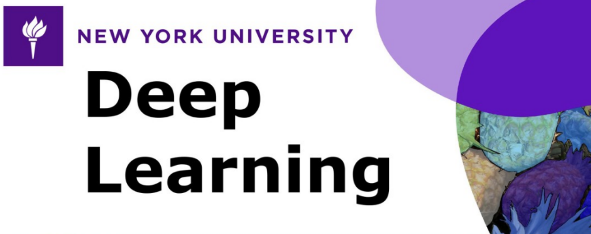

# Deep Learning (New York University)

Welcome to my repo for the course DS-GA 1008 - Deep Learning (2021) from NYU. The course is taught by Yann LeCun & Alfredo Canziani and can be found [here](https://atcold.github.io/NYU-DLSP21/).

## Homeworks
1. [fnn](./fnn/): Implementing both the forward and backward pass of a simple 2-layer neural network 

