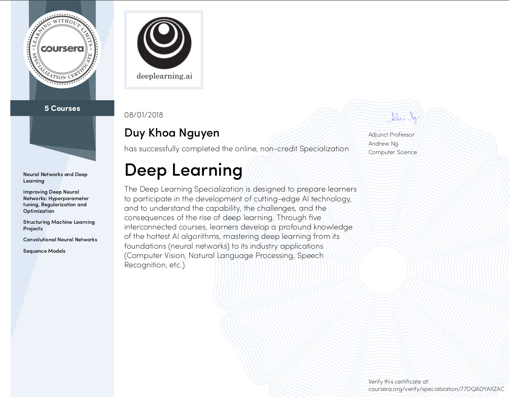

# Deep Learning Specialization - Coursera
Welcome to my repo for the [Deep Learning Specialization](https://www.coursera.org/specializations/deep-learning) by [DeepLearning.AI](https://www.deeplearning.ai/) on Coursera. 

## About this Specialization
In this Specialization, we learn to build and train neural network architectures such as Fully Connected Neural Networks, Convolutional Neural Networks, Recurrent Neural Networks, LSTMs, and learn how to make them better with strategies such as Dropout, BatchNorm, Xavier/He initialization, and more.

## Why this Specialization
AI, especially deep learning, is transforming many industries. This specialization teaches foundational knowledge of current techniques and the capabilities, challenges, and consequences of deep learning.

## Courses
1. [Neural Networks and Deep Learning](./1.%20Neural%20Networks%20and%20Deep%20Learning/): Teaches the foundational concept of neural networks and deep learning such as backpropagation, logistic regression, classification.
2. [Improving Deep Neural Networks: Hyperparameter Tuning, Regularization and Optimization](./2.%20Improving%20Deep%20Neural%20Networks%20-%20Hyperparameter%20tuning%2C%20Regularization%20and%20Optimization/): In this course, we learn optimization methods such as mini-batch gradient descent, momentum, regularization. 
3. [Structuring Machine Learning Projects](./3.%20Structuring%20Machine%20Learning%20Projects/): In this course, we learn to streamline and optimize our ML production workflow and develop time-saving error analysis procedures to evaluate our methods.
4. [Convolutional Neural Networks](./4.%20Convolutional%20Neural%20Networks/): In the fourth course of the specialization, we learn convolutional neural network (CNN) - one of the most influential architectures of deep learning. We learn the fundamentals of CNNs, its applications such as face recognition, autonomous driving and art generation.
5. [Sequence Models](./5.%20Sequence%20Models/): In this final course, we learn recurrent neural networks (RNNs) - an architecture specialized in processing sequencial data. We also learn improved architectures of RNNs such as LSTM and attention.   

## Certification
